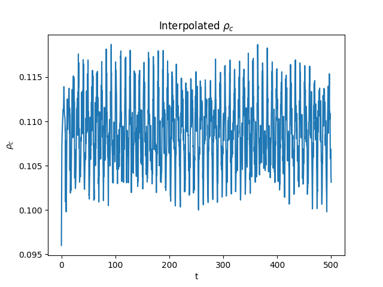
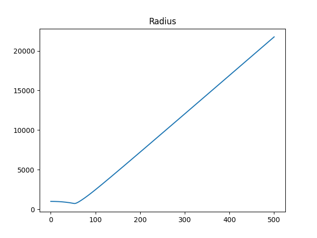
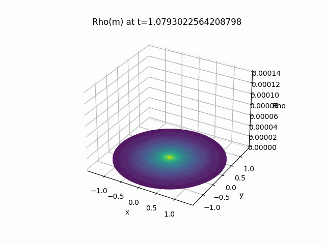
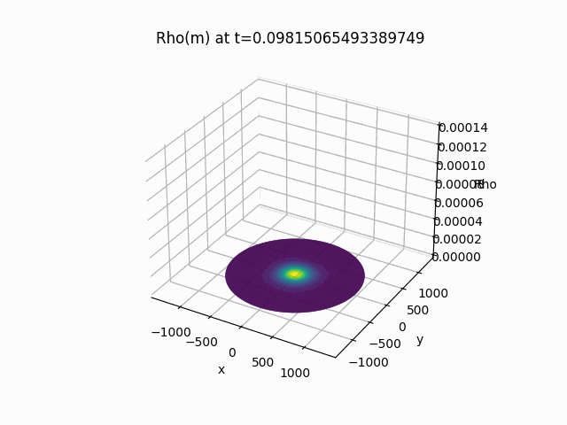
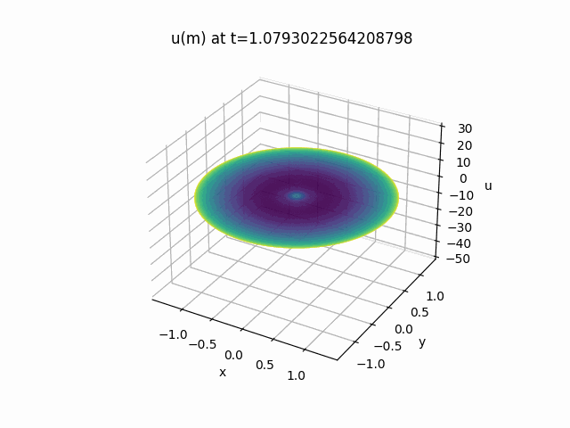

# ComputationalPhysics
Repository for the code and results of Methods of Computational Physics.

## Introduction

I wanted to be able to show the work that I completed in my computational physics class, however I can't post the code. I figured I would take a second to describe the methods we used within the class and showcase the results of the simulations through the animations I created.

This code was written in Python and uses the libraries NumPy, MatPlotLib, and SciPy. It was written object oriented, using grid function objects to store all variables concisely. Classes describing the equations of state to govern the behavior of the star were also stored to simplify calculations. Using initial values, constants (G, radius, k, courant) and an equation of state, the code solves an inital value problem using the defined EOS and SciPy's solve_ivp function to generate the initial data for the star. This returns a gridfunction of the radius values interpolated as to be evenly spaced in mass. From this gridfunction, the code then generates initial gradients for density, e, speed, density, and pressure. Using these initial gradients, the code then integrates the gradients using RK4 integration and differential equations derived in class. 

When left in this initial configuration, the star oscillates in equilibrium as illustrated through the graph of the central density below.

In order to induce collapse, the value of gamma with the equation of state is artificially changed after the generation of the initial gradients. This then causes the star to collapse and remain collapsed, as a result of the fact that the shock generated by the collapse that would cause a supernova is lost in the resolution of the graph. Artificial viscosity to used to spread out the shockwave over multiple grid point. This then causes the star to rapidly explain following the collapse, as seen below.

I then expanded these mass layers into three dimensions and translated the data to polar coordinates in order to create 3d animations. The below animation shows the density at various mass layers over time.

I then interpolated the mass data into its corresponding radius data and created the following animation of the density related to the radius of the star over time.

Here is perhaps the most interesting and most illustrating of the results. This animation shows the speeds of various particles on the Z axis and the mass is shown on the XY axis. You can clearly see the way the shockwave permeates the masslayers as the star collapses and then explodes.

